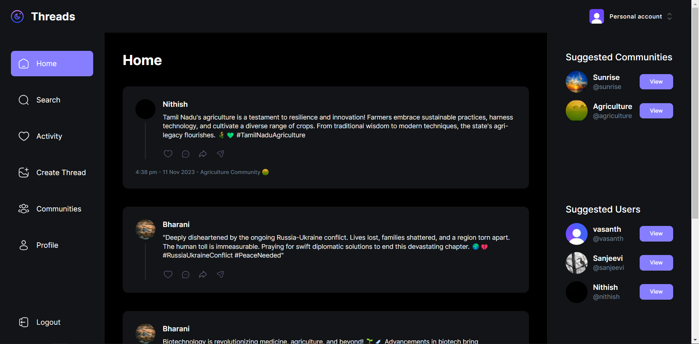

# Threads Clone

Welcome to the Threads Clone repository! This is a simple yet powerful threaded discussion app. You can check out the live version [here](https://threads-clone-chi-orpin.vercel.app/).

## Features

1. **Create Threads:**
   - Start engaging discussions by creating your own threads.

2. **Delete Threads:**
   - If you change your mind or want to remove a thread, the delete feature is at your service.

3. **Follow Other Users:**
   - Stay updated on interesting discussions by following other users.

4. **View User Threads:**
   - Explore and keep up with threads created by users you're following.

5. **Comment on Threads:**
   - Join the conversation by adding your comments to existing threads.

## Technologies Used

- **Next.js:** The framework for building React applications.
- **MongoDB:** A popular NoSQL database for storing thread data.
- **React:** The JavaScript library for building user interfaces.
- **Tailwind CSS:** A utility-first CSS framework for styling the app.
- **Clerk:** Provides user authentication and management.
- **React Hook Form:** Simplifies form handling in React.
- **Mongoose:** Elegant MongoDB object modeling for Node.js.

## Getting Started

1. **Clone the repository:**
   ```bash
   git clone https://github.com/your-username/threads-clone.git
   cd threads-clone
   ```

2. **Install dependencies:**
   ```bash
   npm install
   ```

3. **Run the development server:**
   ```bash
   npm run dev
   ```

4. **Open your browser:**
   Visit [http://localhost:3000](http://localhost:3000) to see the app in action.

## Contributing

If you'd like to contribute, feel free to submit a pull request. Bug fixes, improvements, and new features are always welcome!

## Feedback

If you encounter any issues or have suggestions, please [open an issue](https://github.com/your-username/threads-clone/issues).

Happy threading! 🧵✨
